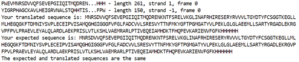

# SWBio_Coding_Assessment
Files and scripts required for the SWBio Data Science and Machine Learning assessment

**README FILE**

This Python script has been written to find open reading frames (ORFs) in a DNA sequence that is derived from recombination of a vector and gene to determine if correct expression should be expected. The example used within the code is from the expression vector pOPINE with the batE gene inserted, but other sequences can be used depending on your chosen vector and the gene you wish to express. 

1.	Download all of the scripts and files from this repository and install [Biopython](https://biopython.org/wiki/Download) if you have not done so already

2.	If using your own data, open findORFs.py and change the necessary parts of the script that are applicable for your data. This includes:
* The relevant [NCBI Genetic Code table](https://www.ncbi.nlm.nih.gov/Taxonomy/Utils/wprintgc.cgi) number 
* min_pro_len – the default is 100

Make sure if using your own DNA sequences that the length is divisible by 3 – a warning will appear in the output if this is not the case.

3.	Open ORF_script.py and change the necessary parts of the script that are applicable for your own data. This includes:
* The fasta file for the find_ORFs function (called BatE_insert.fna under the BatE_pOPINE variable - the BatE_insert.fna file is included in the repository to show working code)
* The gene DNA sequence you wish to translate (called BatE_seq in the script), from the start to stop codon
* The sequence to be translated and the relevant NCBI Genetic Code table number under trans_BatE
* The expected protein sequence (called expected_BatE in the script)

If you change any variable names, remember to change them throughout other parts of the script that require those variables.

4.	Run ORF_script.py in the terminal window

You should get an output that looks like the following if your translated and expected sequences are the same – this is the output from the example data included. The output will change to “the expected and translated sequences are not the same” in the final line if the sequences are different.

